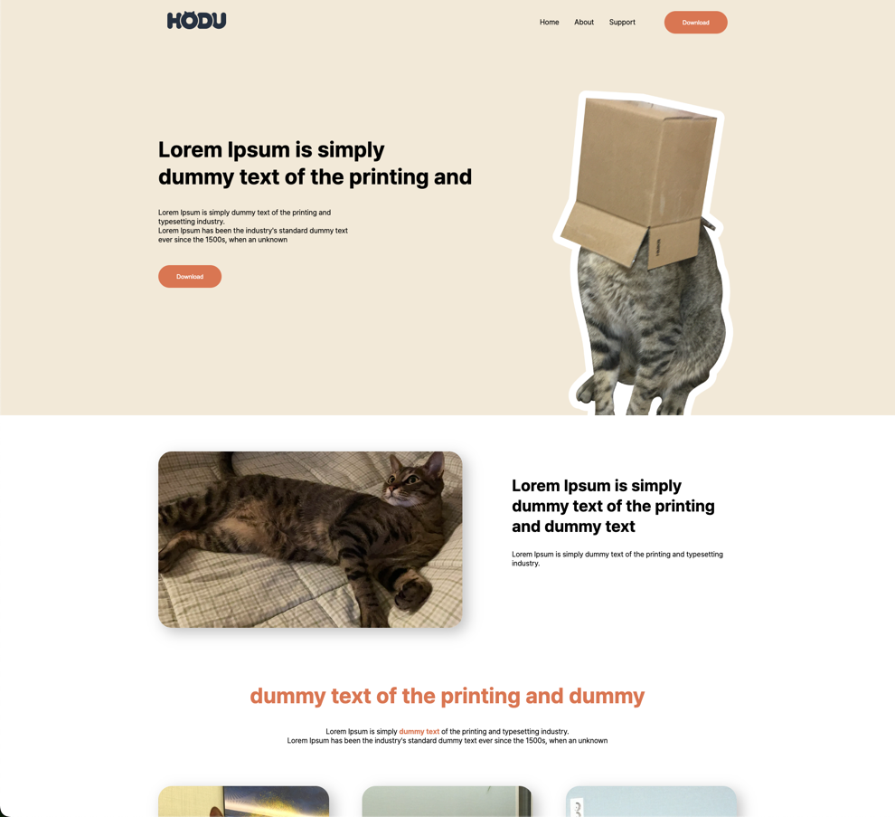
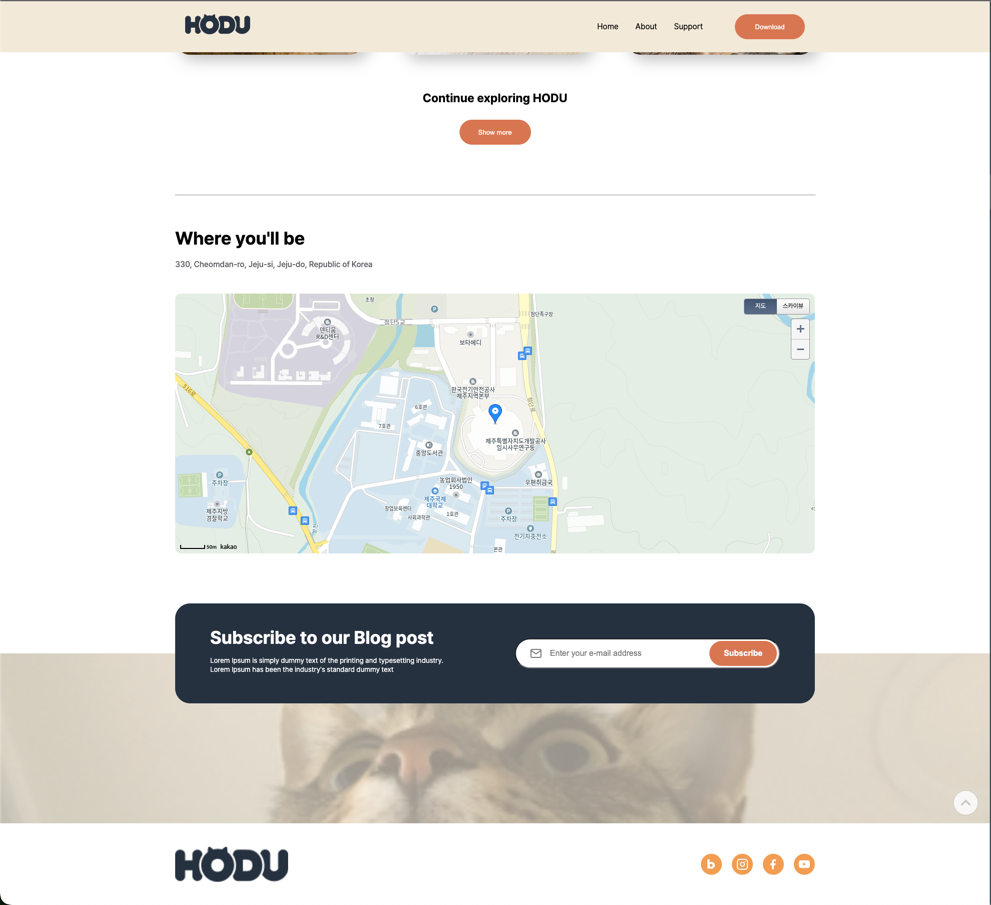
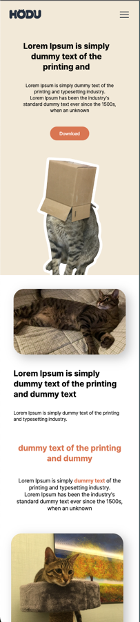
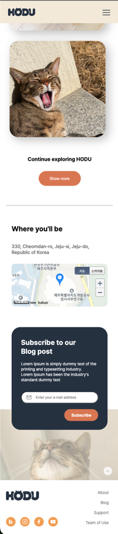

# FrontEndProject 
## 1. 목표와 요구사항
### 1.1 피그마 링크와 요구사항 명세를 참고하여 랜딩페이지 만들기 
[피그마 링크](https://www.figma.com/design/s9RCnA6dSi3QHHeMDFHKE6/EST-%EC%98%A4%EB%A5%B4%EB%AF%B8(BE)_HTML%2FCSS%2FJS?node-id=28501-4177&t=gpv3t28WAalztcGv-1)

### PC 화면 

### Mobile 화면 
width 500px 이하, orientation: portrait 일 때

### 1.2 요구사항 명세
1. 모바일 화면도 고려하여 페이지를 구현합니다.
2. HTML, CSS 를 이용한 레이아웃 구현(자세한 요구사항은 노션페이지 참고해주세요.)
3. JavaScript를 이용한 기능 구현(자세한 요구사항은 노션페이지 참고해주세요.)
4. 지도 구현 부분은 비워두셔도 괜찮습니다. 지도 API를 이용하실 수 있는 부분은 지도 API를 이용해주세요
5. 스크롤시 헤더가 고정되게 합니다. (단, 처음에는 고정된 상태가 아닙니다.)
6. 스크롤 탑 버튼을 구현합니다. 
    1. 스크롤 탑 버튼은 스크롤시 나타납니다.
    2. 스크롤 탑 버튼은 푸터 아래로 내려가지 않습니다.
    3. 스크롤 탑 버튼을 누르면 스크롤이 최상단으로 올라갑니다. (단, 부드럽게 올라가야 합니다.)
7. 구독하기 모달창
    1. 이메일을 입력하고 `Subscribe` 버튼을 클릭하면 모달창이 나타납니다.
    2. 이메일 유효성 검사를 진행해야 합니다. (값이 들어가지 않거나 이메일 형식이 유효하지 않으면 alert 창으로 경고 문구가 떠야합니다.)
    3. 이메일이 잘 입력되었다면 모달창이 뜹니다. 이때 모달창의 `OK! I love HODU` 버튼을 클릭하면 form이 제출되고 모달창이 닫힙니다.
## 2. 개발 환경 
### 2.1 개발 환경 
  - IDE
    * Visual Studio Code
    * IntelliJ IDEA
  - 서비스 배포 환경
    * github pages
### 2.2 배포 URL 
https://songjwans.github.io/estSoft_FrontEndProject

## 3.프로젝트 구조

    ┣ 📂estsoft-FrontEndProject
    ┣ 📂CSS
    ┃ ┣ 📜common.css
    ┃ ┣ 📜kakao.css
    ┃ ┣ 📜mobile.css
    ┃ ┗ 📜reset.css
    ┣ 📂img
    ┃ ┣ 📂README
    ┃ ┃ ┣ 📜mobile1.png
    ┃ ┃ ┣ 📜mobile2.png
    ┃ ┃ ┣ 📜pc1.png
    ┃ ┃ ┗ 📜pc2.png
    ┃ ┣ 📜.DS_Store
    ┃ ┣ 📜Logo-fin.png
    ┃ ┣ 📜arrow-right.png
    ┃ ┣ 📜cat1.png
    ┃ ┣ 📜footer-icon-group.png
    ┃ ┣ 📜image 1.png
    ┃ ┣ 📜img_1-1.png
    ┃ ┣ 📜img_1.png
    ┃ ┣ 📜img_2-1.png
    ┃ ┣ 📜img_2.png
    ┃ ┣ 📜img_3-1.png
    ┃ ┣ 📜img_3.png
    ┃ ┣ 📜img_4.png
    ┃ ┣ 📜img_5.png
    ┃ ┣ 📜img_cat.png
    ┃ ┣ 📜mail.png
    ┃ ┣ 📜menu.png
    ┃ ┣ 📜modal-background.png
    ┃ ┣ 📜scroll-top-btn-hover.png
    ┃ ┗ 📜scroll-top-btn.png
    ┣ 📂javaScript
    ┃ ┣ 📜common.js
    ┃ ┗ 📜kakaoMap.js
    ┣ 📂practice
    ┃ ┣ 📜map.html
    ┃ ┗ 📜modal.html
    ┣ 📜.DS_Store
    ┣ 📜README.md
    ┗ 📜index.html

- CSS
  - common.css : PC CSS
  - mobile.css : 웹 모바일 CSS
  - kakao.css : 카카오 map api CSS
- javascript
  - common.js : PC JS
  - kakaoMap.js : 카카오 map api JS
- img : 페이지에 들어가는 이미지 
- practice : modal, 카카오 map api 연습용
- index.html : 메인이 되는 랜딩 페이지

###  느낀점 
- 정말 디테일한 페이지를 구현하기 위해서는 개발자의 시간과 노력이 필요하다는 것은 느꼈습니다.
- CSS 부분 중 항상 대충 넘어갔던 layout, display 등에 익숙해졌고 활용할 수 있게 되었습니다.
- 프론트엔드에 대해 다시 한번 생각해 볼 수 있는 시간이 된거 같습니다.
